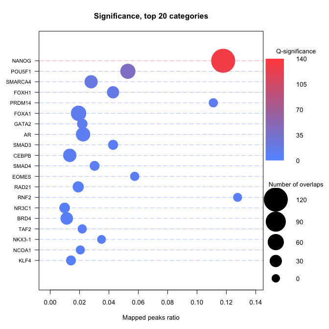

# ReMapEnrich

Bioinformatics tools to compute statistical enrichment of geonomic regions within ReMap catalogue or any other catalogue of peaks. 

## About

Current next generation sequencing studies generate a large variety of genomic regions ranging from regulatory regions with transcription factors or histone marks ChIP-seq to variant calls or coding/non-coding transcripts. Also, the number of complex catalogues from large-scale integrative efforts are increasing and large sequencing projects. To facilitate the interpretation of functional genomics, epigenomics and genomics data we have developed a R-software package `ReMapEnrich` to identify significantly enriched regions from user defined catalogues. `ReMapEnrich` provide functions to import any in-house catalogue, automate and plot the enrichment analysis for genomic regions.

## Getting Started

These instructions will get you a copy of the project up and running on your local machine for development and testing purposes. See deployment for notes on how to deploy the project on a live system.

### Dependencies

Here are dependencies used in our package. Build will prompt for installation. 

```
R.utils, data.table, RMySQL, GenomicRanges
```

### Install the ReMapEnrich R-package from GitHub

To install a R package, start by installing the `devtools` package from CRAN. 

```
install.packages("devtools")
```
Install the ReMapEnrich R-package from GitHub using the following code, where you need to remember to list both the author and the name of the package 

```
library(devtools)
install_github("remap-cisreg/ReMapEnrich")
```

### Installing GitHub packages into RStudio

Although RStudio does have various tools for installing packages, the most straightforward approach is to download the zipped file, open the `ReMapEnrich.Rpoject` file, and in Rstudio Build -> Install and Restart.
Or just follow the steps described in the previous section, entering the code into the Console in RStudio. 


## Using ReMapEnrich

### Basic use

This example is based on small dataset (input and catalog) released with the ReMapEnrich package. It will go through various  steps : loading data,  computing enrichments, visualizing results. 

Please read [Basic use](vignettes/basic_use.md) documentations, and plot examples. 

### Advanced use

Here we will be discovering more advanced functions and possibilities of the ReMapEnrich package. You may want to read the basics functions first in order to understand the principles of enrichment analysis.

Please read [Advanced use](vignettes/advanced_use.md) documentations, and universe usage. 


## Quick Enrichement Code - no fuzz

Please read [Basic use](vignettes/basic_use.md) and [Advanced use](vignettes/advanced_use.md) for full  documentations of ReMapEnrich functionalities. 

#### Load the ReMapEnrich library
```
library(ReMapEnrich) 
```

#### Load the example dataset
```
query <- bedToGranges(system.file("extdata",
                                  "ReMap_nrPeaks_public_chr22_SOX2.bed",
                                  package = "ReMapEnrich"))

```

#### Load the ReMap catalogue
```
# Create a local directory 
demo.dir <- "~/ReMapEnrich_demo"
dir.create(demo.dir, showWarnings = FALSE, recursive = TRUE)

# Use the function DowloadRemapCatalog
remapCatalog2018hg38 <- downloadRemapCatalog(demo.dir)

# Load the ReMap catalogue and convert it to Genomic Ranges
remapCatalog <- bedToGranges(remapCatalog2018hg38)        
```

#### Compute enrichment
The basic way to compute an enrichment is to run with default parameters. - no universe - single core - Default shuffling - defautl overlaps. Please read [Basic use vignette](vignettes/basic_use.md) for more documentations
```
enrichment.df <- enrichment(query, catalog, byChrom = TRUE)
# The option byChrom is set to TRUE as we are only working on one chromosome for this analysis.
```

#### Plot the enriched TFs
Here we display a dot plot. Please read [Basic use](vignettes/basic_use.md) and [Advanced use](vignettes/advanced_use.md) for more  documentations
```
enrichmentDotPlot(enrichment.df)
```



## Authors

* **Zacharie Menetrier** - [ChienBleu](https://github.com/ChienBleu)
* **Martin Mestdagh** - [-](https://github.com/)
* **Jacques van Helden** - [jvanheld](https://github.com/jvanheld)
* **Laurent Tichit** - [Laulo](https://github.com/Laulo)
* **Benoit Ballester** - [benoitballester](https://github.com/benoitballester)


## License

This project is licensed under the MIT License - see the [LICENSE.md](LICENSE.md) file for details

## Acknowledgments

We are grateful to Aurélien Griffon and Quentin Barbier for their very early contributions to this project. 


