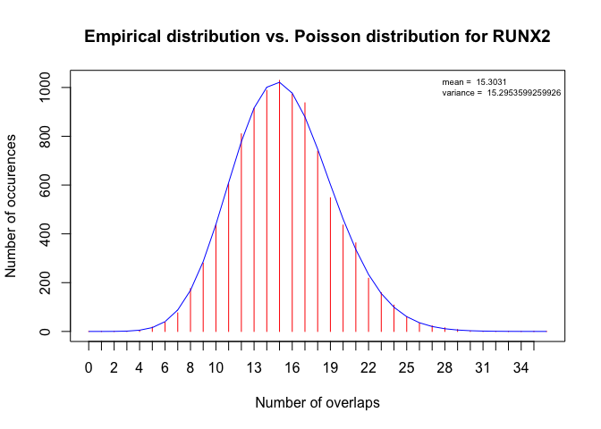
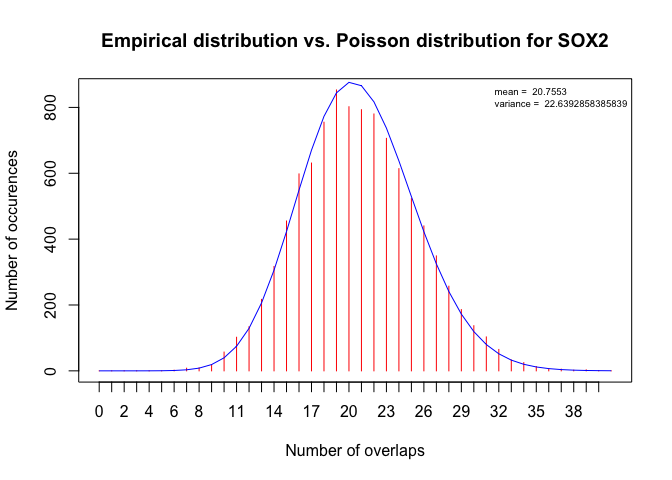
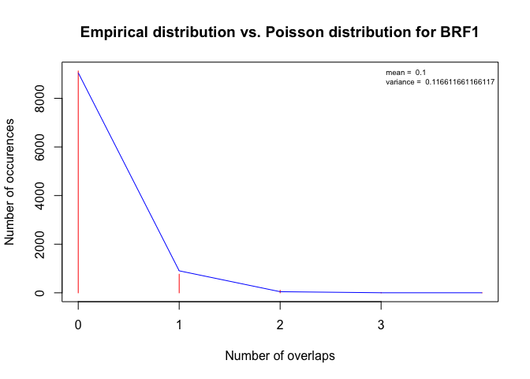
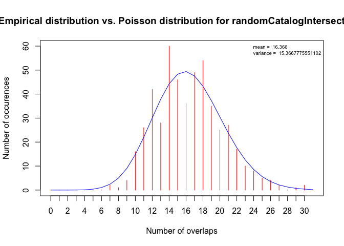

# Abstract

In this vignette we will discuss about the statistical mechanics implied in this package, the results given by statistical validations and how to replicate those results with enough simplicity to statistically validate any experience.

# Poisson distribution

## Quick debrief

Let's repeat quickly what happens in an enrichment computation.

1. The query is overlapped against the catalogue and for each entry of the catalogue, the number of time a region of the query overlapped with it is counted and stored.

2. Shuffles regions are created from the query regions and the point 1 is repeated a certain number of time replacing the user's query with a new shuffle each time.

3. When all the shuffles are done, we now have for each category of the catalogue, the number of time it overlapped with the query regions and the mean number of time it overlapped with a shuffled regions.

## Overlaps number vs. random average

We now have to confront those two properties in a statistical method. From many others, the Poisson distribution has been chosen. First for his simplicity (only takes one parameter - the lambda which is in our case the random average) and secondly because it applies nicely to the genomic overlapping problem considering we don't take in account the width of each overlap but only its absence or presence in a genomic sequence on which oftenly applies time sequence related tools and method (Hidden Markov Model for example).

The upper or lower (depending on the given parameter 'tail') Poisson distribution p-value is now simply extracted from the number of overlaps and the random average for each category of the catalogue. Further corrections are applied as multiple p-values are calculated and stored in the q-value column of the enrichment data frame.

# Verifying the statistical distribution

So long, we assumed that overlapping number in a shuffled/random query against a catalogue followed the Poisson distribution. We now have to verify that assumption on previous experimetns and on a random catalogue.

## Poisson distribution on the ReMap catalogue

The function RandomIntersections is designed to help verifying statistical distribution. All it does is replicating overlaps computations on random regions vs. a given catalogue and returning all the results for each category at every iteration.


As for a solid statistical validation we need to make at least 10,000 iterations and as this will take 30 minutes on a decent computer, results of 10,000 random intersections has been stored in this package and can be easily retrieved.


```r
data("random_regions_vs_ReMap", package = "ReMapEnrich")
head(randomRegionsVsReMap, n = 1)
#>      RUNX2 CDK9 BRD4 TAL1 NR2F2 ERG FLI1 TP63 RUNX1 ESR1 NR3C3 NFYB TCF12
#> [1,]    15   16   50   49    25  59   24   57    59   32    43    9    48
#>      MBD4 TFAP2C GATA3 NCOR1 TCF4 RELA RUNX1T1 DCP1A NCOA1 NFKB1 NR3C1
#> [1,]   26     66    35    10    3   23       6    19     1    34    31
#>      NCOR2 MYC STAG1 TP53 SETDB1 POU5F1 MEF2C ZNF143 FOXP1 GATA1 FOXA1
#> [1,]     0  63    26   14     13     19     3     25     0    22   101
#>      SMAD1 VDR STAT1 AR CEBPA ZBTB33 SNAPC1 PHF8 GATA2 TCF7L2 YY1 CEBPB
#> [1,]    15   6    16 68    26      6      4   10    29     26  34    82
#>      SNAPC4 E2F1 NKX3-1 ZNF76 RNF2 TAF2 SMC4 GTF2B SNAPC5 BRF2 ATRX SUZ12
#> [1,]      3   13      2     2    0    6    0     2      2    1    0     6
#>      RBPJ NOTCH1 CTCF NKX2-1 SMC1A NFYA ETS1 PRAME SMARCA4 MAX RAD21
#> [1,]   17     14   75     13    18    8   32     7      26  74    44
#>      CTNNB1 CBFB RXRA FOXM1 NIPBL ETV1 CDX2 RAC3 HNF4A ESR2 SPI1 BRD2 TCF3
#> [1,]      5    6    7    11     2    6   10    1    32    4   44   21   16
#>      CDK8 BCOR GPS2 BCL6 GABPA TBL1 SP1 KLF4 TAF1 TAF3 E2F7 ELF5 SMAD4
#> [1,]    0    1   11    0    21   14  38   10   18    4    8    2     6
#>      BRD3 E2F6 NANOG JUND SOX2 SMAD3 PPARG USF1 REST SFMBT1 ONECUT1 EGR1
#> [1,]    8   17    22   37   26     7    25   24   26      0       5   27
#>      RUNX3 MAZ SMC3 MAFF MAFK IKZF1 EOMES FOXH1 ARNT SMAD2+3 AHR GREB1
#> [1,]    23  21   15   16   27     4     6    18    0       3   2     2
#>      HSF1 MEIS1 BHLHE40 FOSL2 ORC1 PAX5 PML SIN3A GTF2F1 ATF2 KDM5A MXI1
#> [1,]    1     3      15     9    1    8  13    20      5   12     1   16
#>      POU2F2 KDM5B TBP IRF1 TAF7 ELK1 RFX5 CHD2 FOXP2 ATF3 BRCA1 JUN E2F4
#> [1,]      8     7  24   10    6    4    6   13    18   12     4  22    7
#>      SRF ELF1 CREB1 ATF1 SIX5 USF2 FOS TBL1XR1 SP2 EBF1 CTCFL TEAD4 THAP1
#> [1,]   2   23     3    8    1    5  50       9   3   15     4    21     1
#>      ZEB1 RUNX1+3 TAp73a ZNF263 PBX3 UBTF CBX3 BCLAF1 NR2C2 RBBP5 RCOR1
#> [1,]    2       0     11     25    3   10    9      5     1    13    14
#>      FOSL1 BCL3 NFATC1 MEF2A CCNT2 BACH1 HDAC2 TAp73b ZNF274 BATF HMGN3
#> [1,]     2    9      3     3    10     9    17     15      2   11     8
#>      ZBTB7A MED12 EZH2 JUNB SP4 TFAP2A TRIM28 HNF4G GTF3C2 CTBP2 SAP30
#> [1,]     11     0   14    4   3      6     15     6      1     9     2
#>      CHD1 STAT5A HDAC1 ELK4 NRF1 STAT3 FOXA2 SMARCC1 SMARCB1 ESRRA STAT2
#> [1,]    9      7     5    3    7    26     9       3       1     0     4
#>      MYBL2 NF1C SREBP1 ARID3A CEBPD IRF4 BCL11A MTA3 ZNF217 STAT5B STAT4
#> [1,]    10   12      2      9     3    6      7    4      5      5     4
#>      GATA6 HDAC8 NFE2 TFAP4 IRF3 WRNIP1 GATAD1 HDAC6 ZKSCAN1 PRDM14 RPC155
#> [1,]     2     3    1     1    1      6      0     2       2      3      2
#>      PPARGC1A TLE3 BDP1 ELL2 RB1 SIRT6 SMARCC2 PRDM1 FAM48A NELFE AFF4
#> [1,]        2    0    1    0   0     1       0     1      0     0    0
#>      ZZZ3 BRF1
#> [1,]    0    1
```

We now obtained results of overlapping for 10,000 random regions against the ReMap catalogue. We want to check if such results follow the Poisson distribution. A function has been implemented in the package to get a goodness of fit test of the random intersections vs. the Poisson distribution.


```r
chi2results <- fitPoisson(randomRegionsVsReMap, showCategories = FALSE)
head(chi2results)
#>           chi2.p chi2.df chi2.obs  lambda
#> RUNX2 0.71733086      26 22.46971 15.3031
#> CDK9  0.15964309      25 32.94386 15.7854
#> BRD4  0.01046078      42 66.99694 43.7555
#> TAL1  0.90204573      41 30.82112 42.2820
#> NR2F2 0.31822006      32 36.22137 25.4890
#> ERG   0.41660437      49 51.43274 60.0249
```

The goodness of fit test is obtained with a chi2 comparison for each class of the histogram of the random distribution vs. the Poisson distribution with the corresponding lambda (which is obtained from the mean of the random intersections for each category of the catalogue). This kind of results can be obfuscating for amateur statisticians. That's why we will now present some results in a graphical representation for some of the category (237 in total).


```r
# An easy to do function to create histogram for any result for a category
MakeHistogram <- function(results) {
    h <- hist(results, breaks = -1:(max(results)+1), plot = FALSE)
    expOverlaps <- dpois(x = 0:(max(results)+1), lambda = mean(results)) * sum(h$counts)
    plot(h$counts, col ="red", type = 'h', xaxt = 'nt',
         xlab = "Number of overlaps", ylab = "Number of occurences",
         main = paste("Empirical distribution vs. Poisson distribution for", deparse(substitute(results)))
    )
    axis(side = 1 ,labels = c(0:max(results)), at = c(1:(max(results)+1)))
    lines(expOverlaps, col = "blue")
    legend("topright",
           paste(
            "mean = ", mean(results),
            "\nvariance = ", var(results)
        ), cex = 0.6, bty = 'n'
    )
}
# The best fit is RUNX2
RUNX2 <- randomRegionsVsReMap[,"RUNX2"]
MakeHistogram(RUNX2)
```

<!-- -->

```r
# SOX2 is an average fit
SOX2 <- randomRegionsVsReMap[,"SOX2"]
MakeHistogram(SOX2)
```

<!-- -->

```r
# The worst fit is BRF1
BRF1 <- randomRegionsVsReMap[,"BRF1"]
MakeHistogram(BRF1)
```

<!-- -->

## Poisson distribution on random catalogue

After verifying the fit on Poisson distribution for the ReMap catalogue we now want to check on a totally random catalogue to see if the Poisson distribution is still the best to follow.


```r
# Creating a random catalogue with only one category 'Vert'.
randomCatalog <- genRegions(10000, 200)
# Reduce is a GenomicRanges function designed to merge overlapping regions.
randomCatalog <- reduce(randomCatalog)
# Creating one category for each regions.
randomCatalog@elementMetadata$id = "Vert"
randomCatalogIntersections <- randomIntersections(randomCatalog, iterations = 500, regionNb = 1000, regionSize = 1000)
#> Generating random regions.
#> Computing intersections. This may be long.
MakeHistogram(randomCatalogIntersections)
```

<!-- -->

On this example, only 500 iterations have been made and we can already see that the Poisson distribution seems to nicely describe our empirical values.

# Statistically validate your experiments

After any enrichment experiments, you may want to ensure that the statistical methods involved, are still valid.
Let's make an enrichment analysis with further statistical validations. If you don't understand all the parameters in this experiment, please refer to the "Advanced use" vignette before.


```r
catalog <- bedToGranges(downloadRemapCatalog("demo.dir"))
query <- bedToGranges(downloadEncodePeaks("ENCFF001VCU", "demo.dir"))
universe <- bedToGranges(downloadEncodePeaks("ENCFF718QVA", "demo.dir"))
enrichment <- enrichment(query, catalog, universe = universe, byChrom = TRUE, shuffles = 10, included = 0.5, nCores = 7)
```

To validate such an enrichment we need to apply the function RandomIntersections with the exact same parameters. Most important, we will now obtain our random regions through the parameter 'shuffle' as we want to ensure that the same conditions apply in the experiment which use shuffled regions and not randomly generated regions.


```r
randomIntersections <- randomIntersections(catalog, iterations = 10000, universe = universe, included = 0.5, shuffle = query, byChrom = TRUE)
chi2results <- fitPoisson(randomIntersections)
```

This part of the vignette is not evaluated as 10,000 iterations may take a long time even when parallelizing to maximum (refer to parameter 'nCores' for more details). It is only here as an example to reproduce validation with any enrichment computation you want to validate more consequently.
